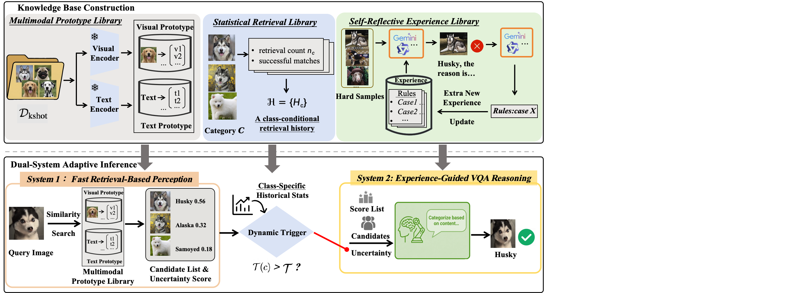

# SARE: Self-Adaptive Reasoning Enhancement

This is the anonymous repository for the paper submission. This repository contains the implementation of SARE, a self-adaptive reasoning enhancement framework for fine-grained visual recognition.

## 📋 Overview

SARE introduces a dual-system cognitive framework inspired by human cognition:
- **System 1 (Fast Thinking)**: Rapid pattern recognition using cached knowledge
- **System 2 (Slow Thinking)**: Deliberate reasoning with experience-based retrieval



## 🎯 Key Features

- **Self-Belief Mechanism**: Dynamic confidence assessment for adaptive reasoning
- **Experience Base**: Multimodal retrieval-augmented generation
- **Knowledge Base**: Category-level feature caching for fast inference
- **Dual-System Architecture**: Automatic switching between fast and slow thinking

## 📁 Project Structure

```
SARE/
├── agents/
│   └── mllm_bot.py              # MLLM interface
├── retrieval/
│   └── multimodal_retrieval.py  # Multimodal retrieval module
├── main.py                       # Main entry point
├── system1.py                    # Fast thinking system
├── system2.py                    # Slow thinking system
├── fast_slow_thinking_system.py # Integrated dual-system
├── knowledge_base_builder.py    # Knowledge base construction
├── experience_base_builder.py   # Experience base construction
├── description_generator.py     # Visual description generation
├── config_template.yaml         # Configuration template
├── requirements.txt             # Python dependencies
└── fig/                         # Figures and visualizations
```

## 🚀 Getting Started

### Prerequisites

- Python 3.9+
- CUDA 11.8+ 
- 24GB+ GPU memory (for Qwen2.5-VL-7B)


### Quick Start

#### 1. Build Knowledge Base

First, build the category-level knowledge base from training data:

```bash
python main.py \
    --mode build_knowledge_base \
    --config_file_env ./configs/env_machine.yml \
    --config_file_expt ./configs/expts/dog120_all.yml \
    --num_per_category 10 \
    --knowledge_base_dir ./experiments/dog120/knowledge_base
```

This creates:
- Category prototypes
- Visual descriptions
- Self-belief statistics

#### 2. Build Experience Base (Optional)

Build the instance-level experience base:

```bash
python main.py \
    --mode build_experience_base \
    --config_file_env ./configs/env_machine.yml \
    --config_file_expt ./configs/expts/dog120_all.yml \
    --experience_base_dir ./experiments/dog120/experience_base
```

#### 3. Run Inference

Run the SARE inference:

```bash
python main.py \
    --mode fast_slow \
    --config_file_env ./configs/env_machine.yml \
    --config_file_expt ./configs/expts/dog120_all.yml \
    --knowledge_base_dir ./experiments/dog120/knowledge_base \
    --test_data_dir ./datasets/dogs_120/test \
    --results_out ./results/dog120_results.json \
```

